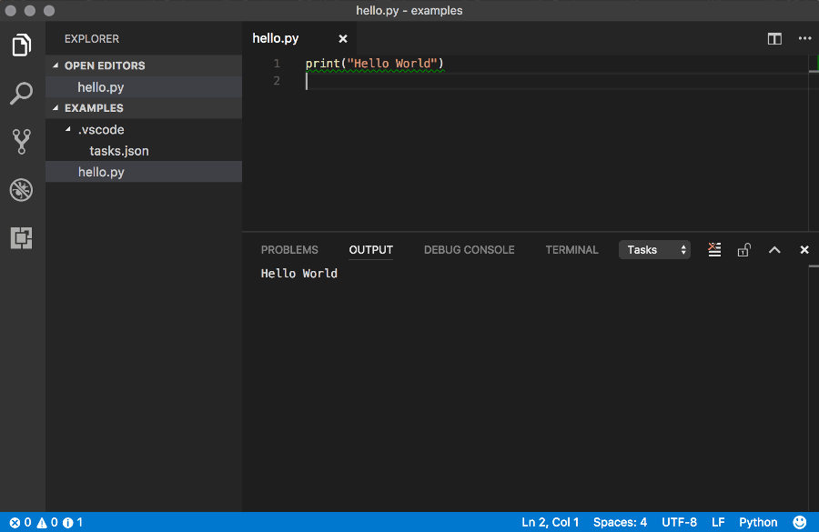

# Let's explain the File Editor and Terminal on Killercoda
**Terminal** 
The Terminal is like the Command Prompt on your Windows computer. Using that, you can do everything that you can achieve via mouse and keyboard and more, from creating folders to changing computer settings.

Killercoda has Python pre-installed within the system which allows us to run `python hello.py`{{copy}}. What that does is ask the installed Python module to run a file called *hello.py*.

**File Editor** 
The File Editor is a bit like your computer. You can have folders and then files inside of those folders. These files are just like files on your computer - images, videos etc. Pictures might be named `dog.png` or `cutebunnies.jpg` for example, while we name Python files as `example.py`. Python files are like other files, and we simply name the file extensions as `.py` so that programmes know it's a Python file.

1. Go to the editor tab on the right hand side
2. Create a new file called hello.py by right-clicking on the file explorer and click new file.
3. Copy the code above over to the editor
4. Type `python hello.py`{{exec}} into the terminal. You can also type that yourself via the Terminal (bottom right) and then press ENTER to execute it.

# Online Python Editors
Want to quickly write and run simple Python code but not install Python on your computer? Try some of these online options!
- [replit](https://replit.com/languages/python3)
- [Google Colab](https://colab.research.google.com/)
- [W3Schools](https://www.w3schools.com/python/trypython.asp?filename=demo_compiler)
- [Visual Studio Code - Browser Version](https://vscode.dev/) (can edit but not run code)

You can click the code snippets below to copy the code to a Python file in your editor (top right).

Messy Terminal? Type in `clear` in the terminal to clean it.

<marquee style='color: blue;'><b>Yay you've completed part 1!</b></marquee>
