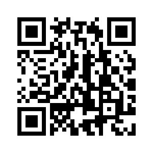

## Scan here to join the platform:


# Basics

Variables are containers for storing data values. You can store any value in a variable, then use it or change its value later on in the program. We can also print out the variables using `print()`.

You can store different types of data in variables as shown below. Text is stored as strings, numbers can be stored as integers (whole numbers) or floats (decimals). There is also booleans that act as a true/false and can only store these values. 


```
# This is a comment
# Python will not run this
# Use comments so you remember what the code does
myCardPin = 1234
```{{exec}}

```
print(myCardPin)
```{{exec}}

```
a = 2
print(a)
```{{exec}}

Note: Variables in Python are case sensitive, so `myCardPin` and `MyCaRdPiN` are two separate variables.

We can assign a new value to an existing variable.

```
myCardPin = 2222
print(myCardPin)

myCardPin = 5555
print(myCardPin)

myCardPin = 1382929292
print(myCardPin)
```{{exec}}

<span style="color:green">✓</span> Valid variable names:
* `days_to_christmas`
* `Currency`

<span style="color:red">✗</span> Invalid variable names:
* `10t` - <span style="color:red">must begin with a letter</span>
* `Exchange Rate` - <span style="color:red">must not contain a space</span>
* `?` - <span style="color:red">must not be punctuation</span>*

Python also has a list of [reserved words](https://www.w3schools.com/python/python_ref_keywords.asp) that cannot be used as variable names.

# More about variables
Try these commands.

```
b = 4
print(b)
```{{exec}}

```
b = b+2
print(b)
```{{exec}}

```
b += 2
print(b)
```{{exec}}

You can also use `+`, `-`, `*`, `/`, `//`, `%`, `**` etc. [More Info](https://www.w3schools.com/python/python_operators.asp).

```
print(2+3)
print(2-3)
print(2*3)
print(2/3)
print(2//3)
print(2%3)
```{{exec}}

# Quick Exercises
- Save your age as a variable
- Save the current year (2022 as of writing) as a second variable
- Subtract the current year by your age (using the variables) and save that as a third variable
- Print out the third variable
- You've found your birth year! (We're assuming you were born on 1st January to keep this task simple.)

# Practical Uses
The calculator app on your phone remembers every number as you type it, as well as your previous calculations, thanks to variables. Microsoft Teams remembers your user settings and stores them as variables. Your phone stores your password as a variable too. (Okay, there's a few more steps involved in real life, but you get the idea.)

