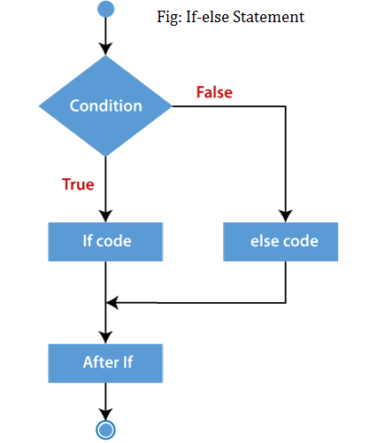

# Using Comparisons & Conditions

<br>

You don't have to understand `if` statements right now - we'll cover those in the next module. But here's why comparisons can come in handy, and why Python can be a versatile language.

```
age = 17

if age < 18: 
    print("You're too young to buy scissors.")
else:
    print("You are old enough to buy scissors")
```{{exec}}

```
age = 17
if age < 0: 
    print("You haven't been born yet.")
else:
    print("You are born")
```{{exec}}

<hr>

# Indentation

See how the `print` statement above is indented? It means it sits under the `if` statement, and will only run if the conditions of that `if` statement is true.

To indent a line, you have a few options. Choose one and then start a fight with the others over which one is superior:

- press <kbd>SPACE</kbd> 4 times
- press <kbd>SPACE</kbd> 2 times
- press <kbd>TAB</kbd> once

Indentation is very important. While other programming languages allow you to write horrifyingly unindented code and wrap them in ```{}``` brackets, Python relies on your indentation to know when to run what code. Remember this!

# Exercises
## Exercise 1:
Ask user to enter a number, if the number is less than 10, print “Number is too high!”. Otherwise print "Valid Number"
[Click here for solutions.](https://github.com/VCCBeginnerCoding/katacoda-scenarios/blob/main/1_PythonWeek1/answers/step5.md)

# Kahoot Time!!!
Once we reach this point, lets see who can get the highest kahoot score based on what we have learnt so far!

# You have finished part 2!