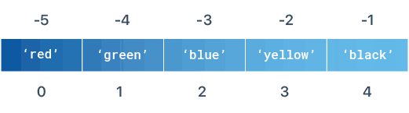

# Lists
Messy Terminal? `clear`{{execute}} it.


Now let's move onto something new, Lists. Lists are a new type of Data Type which you haven't met yet, they are a structure which allows us to store multiple variables within them.

**Why do we need to store multiple variables?** In some programs there are many variables that the program has to work with, sometimes up to the hundreds or thousands, having a list to store these in and handle them saves a lot of time and makes the code a lot more efficient.


## Initialising Lists

Lists are multi-value variables which can have variables within them all the same types or of different types. Some of them may be integers, strings, booleans or even other lists (this is called nested listing). Below is an example of how to declare a list, in this instance we are declaring a list of strings and a list of strings and numbers:


```python
names = ["Ellie", "Dan", "Perry", "Justin"]
food = ["Apple", 3, "Chocolate", 3, "Sandwich", 4, "Cake", 1]
print(names)
print(food)
```

*Hint: Lower and Upper case matters in string equality*


As you can see, there are some similarities to how you declare a variable, you need to:
- Give a name for the list
- Have an equals sign which declares it is a variable and sets it to the values you put on the right side of the equals sign

But you also need to separate each individual list items with a comma "," within the square brackets `[item1, item2]`.

You can also declare a list using pre-existing variables as shown below:

```
name1 = "Ellie"
name2 = "Dan"
names = [name1, name2]
print(names)
```

## Accessing list items (indexing):
* How do we print the last item in a list?
* How do we print the first item in a list?
* How do we print the first 3 items in a list?

First we need to understand list indexing. Python assigns an index to each item of a list which we can use to access items of a list.  

*It is important to remember that elements in a list are always **numbered starting from zero**, so in our first 'names' example "Ellie" is the first element and is in position 0 of the list. The final element is "Justin" and is in position 3 of the list.*



* We can also see that python provides "negative indexing" which can be helpful to get the last item in a list or the second to last item in a list and so on.

What will these print?
```python
myList = ["apple", "orange", "banana"]
print(myList[1])
```

```python
myList = ["apple", "orange", "banana"]
print(myList[-1])
```

```python
myList = ["apple", "orange", "banana"]
print(myList[3])
```

```python
myList = ["apple", "orange", "banana"]
print(myList[0:2])
```

# Exercises:
1. Create a list of your favourite movies and print it out.
2. Create a list of your 3 favourite holiday destinations and print it out in this format:
   * "My favourite holiday destinations are: list_goes_here"
3. Write a program that creates a list containing 5 fruits:
   * Ask the user for an index position
   * Print the fruit that corresponds with the index position
   * Challenge: Validate the user's input before accessing the list to prevent the index out of bounds error.
4. Write a program that creates a list of 5 movies:
   * Ask the user how many movies they would like to be recommended.
   * Print out the number of movies the user requested
   * E.g. If the list was: "one", "two", "three" and the user wanted 2 items, the program should print:
     * "one", "two"
   * Challenge: Validate the user's input to prevent an index out of bounds error

# You have completed part 1!
Kahoot time!!!!