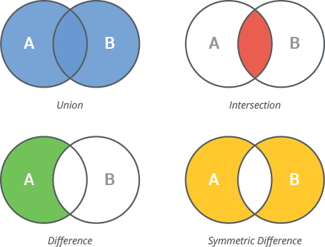

# Set Operations
The true usefulness of sets can be utilised when using them with special set operations.

## Set Functions
* intersection()
* union()
* difference()
* symmetric_difference()



### Intersection
The intersection function will return a set consisting of all the elements that are shared between the two sets.
```python
multiples_3 = {3, 6, 9, 12, 15, 18, 21, 24, 27, 30}
multiples_5 = {5, 10, 15, 20, 25, 30}

common_multiples = multiples_3.intersection(multiples_5)
print(common_multiples)
```{{exec}}

### Union
The union function will return all the items that are present in the two sets it is applied to. Note this includes the itms shared by both sets.
```python
odd_nums = {1,3,5,7,9}
even_nums = {2,4,6,8,10}

all_nums = odd_nums.union(even_nums)
print(all_nums)
```{{exec}}

### Difference
The difference function will return all the items in the first set that are not present in the second set.
```python
multiples_3 = {3, 6, 9, 12, 15, 18, 21, 24, 27, 30}
multiples_5 = {5, 10, 15, 20, 25, 30}

multiples_3_but_not_5 = multiples_3.difference(multiples_5)
print(multiples_3_but_not_5)
```{{exec}}

### Symmetric Difference
The symmetric difference function will return all the items that are unique to both sets.
```python
customers_with_sesson_pass = {"c1", "c2", "c5"}
customers_with_vip_pass = {"c1", "c3 ", "c4", "c5"}

customers_with_only_one = customers_with_sesson_pass.symmetric_difference(customers_with_vip_pass)
print(customers_with_only_one)
```{{exec}}

# Exercises
## 1
* Define the following sets
* multiples_3 = {3, 6, 9, 12, 15, 18, 21, 24, 27, 30}
* multiples_5 = {5, 10, 15, 20, 25, 30}
* Return all the numbers that are unique to every set
## 1.2
* Add the following set
* multiples_6 = {6, 12, 18, 24, 30}
* Return all the numbers that are unique to every set

## 2
* Create a set to store your top 3 favourite colours
* Ask the user to enter their top 3 favourite colours and store their answers in another set
* If you and the user share any of the same colours, output the message: "Wow! I like _____ too!", replace the underscore with the shared colour
* If you and the user do not share any of the same colours, output the message: "We don't like the same colours" 